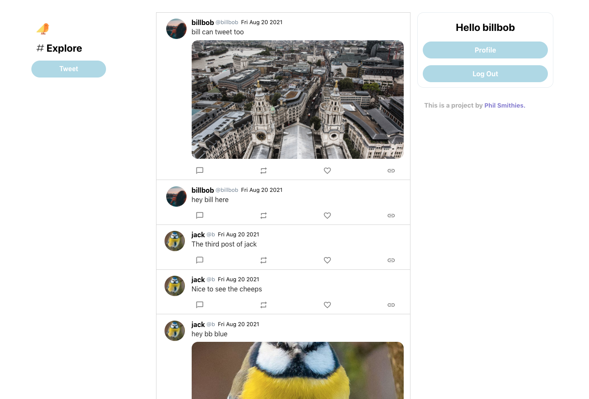

# Chitter 

<!-- Table of Contents -->
## Table of Contents

- [Overview](#overview)
- [Live Demo](#live-demo)
  - [Screenshots](#screenshots)
- [Getting Started](#getting-started)
  - [Development](#development)
- [Brief](#brief)
- [Features](#features)
  -[To Add](#to-add)
- [Design](#design)
  - [Technologies Used](#technologies-used)
- [User Stories](#user-stories)

<!-- Overview -->

**Chitter:** A full-stack web app inspired by [Twitter.](https://www.twitter.com/) Within the app the user can sign up, add a profile photo as well as add photos to their posts. As well as update their profile with banner images and a bio. The application was built in React and Node JS, and was a help in understanding JWT's and the authentication process. 

<!-- Live Demo -->

## Live Demo

**[Check it out here.](https://fierce-chamber-73937.herokuapp.com/)** 
### Screenshots



## Getting started

### Development

To get started with the app, first clone the repo and `cd` into the directory:

```
$ git clone https://github.com/philsmithies/chitter-react.git 
$ cd react-chitter
```

Then install the dependencies for the backend:

```
$ cd server
$ npm install
```

Install Frontend dependencies:

```
$ cd ..
$ yarn install
```

Then run the backend in a local server:

```
$ cd server
$ nodemon app
```

Run the frontend in a local server:

```
$ cd ..
$ yarn start
```

The server will automatically start in your browser or you can view it by visiting: 
```
$ http://localhost:3000/
```

## Design

### Technologies Used

I used the following technologies to build Chitter.

- [React](https://reactjs.org)
  - Used as the Javascript framework of choice for the project. Handles the views logic of the project. 
- [MongoDB](https://www.mongodb.com)
  - The database technology used. 
- [NodeJS](https://nodejs.org/en/)
  - The technology used to handle the backend including authentication and other database requests. 
- [Jest](https://jestjs.io)
  - Used for testing.
- [HTML](https://developer.mozilla.org/en-US/docs/Web/Guide/HTML/HTML5) 
  - Used within the JSX components in React.
- [CSS](https://developer.mozilla.org/en-US/docs/Archive/CSS3) 
  - Used for the overall look of the site and its elements.
- [Flat Icon](http://flaticon.com/)
  - Used for the icons and SVG files.
- [Google fonts](https://fonts.google.com/) 
  - Fonts.
- [Git](https://git-scm.com/)
  - Used for version control. 
- [Heroku](https://www.heroku.com/)
  - Used to host the web app.

<!-- Brief -->
## Brief
Build Twitter!

Your challenge is to build Instagram using React and NodeJS. You'll need to have a log in, sign up and a feed element. Along with a profile page that the users can update with all their personal information. Style it like Twitter or use your personal creativity. 

<!-- Features -->

## Features

- Create an account
- Sign in with created account
- Post a tweet.
- Add a photo to a tweet. 
- View own tweets on your profile. 
- View tweets of the chosen user's profile.
- View other user profiles.
- Remain logged in (remember token)
- Log out

### To Add
- Like a user's tweet
- Comment (@) on a user's tweet
-  More UI features including a tweet text box, character length limit, retweet function. 

### User Stories

```
As a User
So that I can let people know what I am doing  
I want to post a message (peep) to chitter
```

```
As a user
So that I can see what others are saying  
I want to see all peeps in reverse chronological order
```

```
As a User
So that I can better appreciate the context of a peep
I want to see the time at which it was made
```

```
As a User
So that I can post messages on Chitter as me
I want to sign up for Chitter
```

```
As a User
So that only I can post messages on Chitter as me
I want to log in to Chitter
```

```
As a User
So that I can avoid others posting messages on Chitter as me
I want to log out of Chitter
```
<div align="center">

---

[Top](#table-of-contents)

---

</div>
